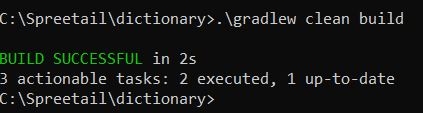
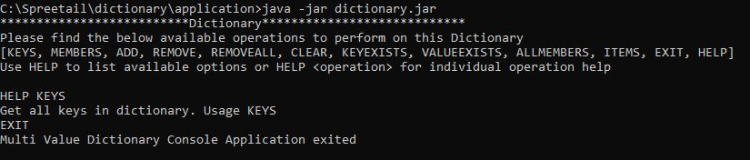
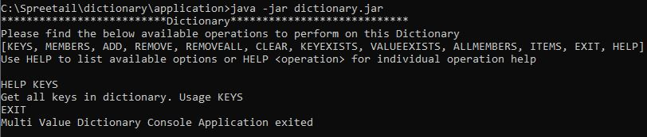

# Dictionary Console Application

The Multi-Value Dictionary app is a console application that stores a multivalue dictionary in memory.
All keys and values are strings and support following commands as mentioned below.
keys and their Values stored in this dictionary are case sensitive.


# Documentation
List of available operations that can be performed in the console

```
KEYS, MEMBERS, ADD, REMOVE, REMOVEALL, CLEAR, KEYEXISTS, VALUEEXISTS, ALLMEMBERS, ITEMS, EXIT, HELP
```
For detailed description of each operation please use below documentation.

[Available Commands](./documentation/CommandsDescripton.md)

To get operation description for individual operation in console use HELP

```
HELP <operation>
example: HELP KEYS
```
Please verify this word document for detail description of each operation and their usage


# Application Requirements

Java Version : Java 8 and above

Gradle version: 4.8.1 and above

# Building application in your local
Go to project root directory and run below in your command line

```
.\gradlew clean build
```



# Running Dictionary Console Application

#### Running the delivered executable jar
Added executable jar for convenience. You can run the dictionary.jar available in application folder in project root directory.

Before running the jar make sure java home is set in your environment. Please verify helpful links at the bottom for more information about setting JAVA_HOME.

```
change to application directory from your project root directory 

cd ./application

Run below command:

java -jar dictionary.jar
```



#### Building and running executable jar
After running .\gradlew clean build you can see the dictionary executable jar in <project root directory>/build/libs/dictionary.jar



Above commands ran in windows environment for mac/linux you should be able to run similar commands

# Importing Project into IDE's

Used eclipse to develop this project. You should be able to import this project in popular IDE using import existing gradle project wizard.

[How to Import gradle project into eclipse](https://findanyanswer.com/how-do-i-import-a-gradle-project-into-eclipse)

[How to Import gradle project in IntelliJ](https://www.jetbrains.com/help/idea/gradle.html#gradle_import_project_start)

# Helpful Link

[Set JAVA_HOME for windows](https://confluence.atlassian.com/doc/setting-the-java_home-variable-in-windows-8895.html)

[Set JAVA_HOME for macOS](https://mkyong.com/java/how-to-set-java_home-environment-variable-on-mac-os-x/)

[Java SE Development Kit 8 Downloads](https://www.oracle.com/java/technologies/javase/javase-jdk8-downloads.html)
