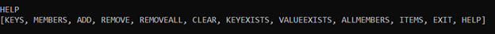
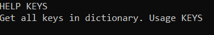
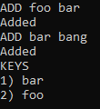
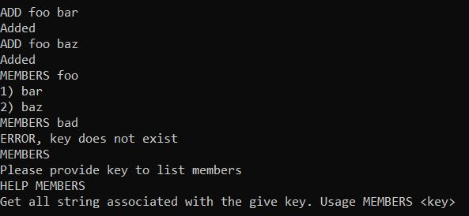
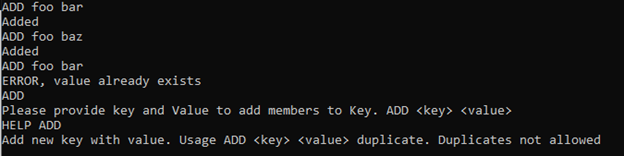
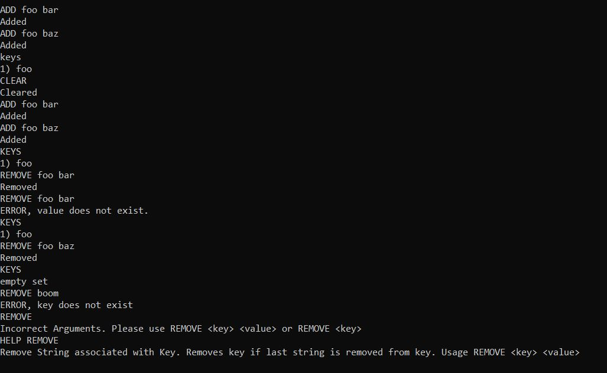

# Multi-Value Dictionary Console Application
The Multi-Value Dictionary console application is a command line application that stores a multivalue dictionary in memory. 
All keys and values are strings and support following commands as mentioned below. 

keys and values are case sensitive.

Following commands are supported.

### HELP

Give information about all available operations that can be performed.

Use HELP for available operations or HELP <operation> for specific operation.

Example:

```
HELP
```



```
HELP KEYS
```



### KEYS
Returns all the keys in the dictionary.  Order is not guaranteed.

```
KEYS
```
  
Example:



Returns empty set if dictionary is empty.


### MEMBERS
Returns the collection of strings for the given key.  Return order is not guaranteed.  Returns an error if the key does not exists.

 ```
 MEMBERS <key>
 ```
 
Example:



### ADD
Add a member to a collection for a given key. Displays an error if the value already existed in the collection. 
  
```  
ADD <key> <value>
```

Example:




### REMOVE
Removes a value from a key. 

If the last value is removed from the key, they key is removed from the dictionary.

If the key or value does not exist, displays an error. 

```
REMOVE <key> <value>
```
 
Example:


  
### REMOVEALL
Removes all value for a key and removes the key from the dictionary. 
Returns an error if the key does not exist.

```
REMOVEALL <key>
```
Example:


### CLEAR
Removes all keys and all values from the dictionary.

```
CLEAR
```

Example:


### KEYEXISTS
Returns whether a key exists or not. 
  
```
KEYEXISTS
```
Example:


  
### VALUEEXISTS
Returns whether a value exists within a key.
Returns false if the key does not exist.
  
```
VALUEEXISTS <key> <value>
```

Example:


### ALLMEMBERS
Returns all the values in the dictionary.  Returns nothing if there are none. Order is not guaranteed.
  
```
ALLMEMBERS
```

Example:


### ITEMS
Returns all keys in the dictionary and all of their values.  Returns nothing if there are none.  Order is not guaranteed.
  

```
ITEMS
```

Example:


### EXIT
Stops and Exists from the console application.

```
EXIT
```

Example:


  